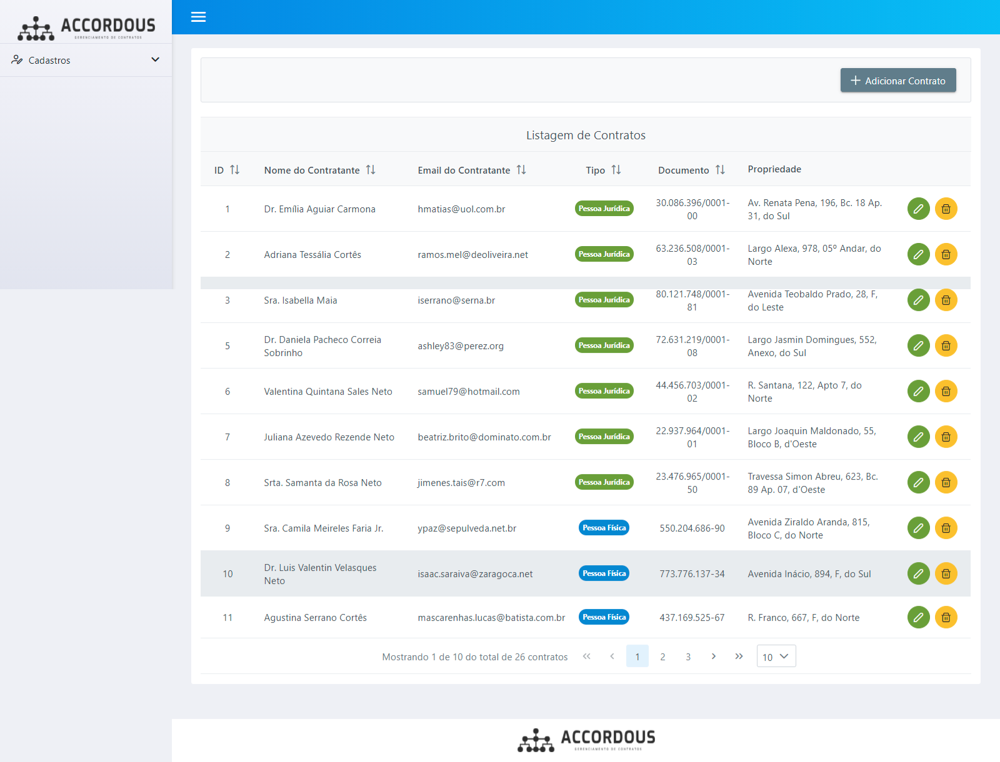

<h4 align="center">
  🚀 Accordous - Gerenciamento de Contratos - Teste técnico
</h4>

<p align="center">
 

  
</p>

<p align="center">
  <a href="#rocket-tecnologias">Tecnologias</a>&nbsp;&nbsp;&nbsp;|&nbsp;&nbsp;&nbsp;
  <a href="#-projeto">Projeto</a>&nbsp;&nbsp;&nbsp;|&nbsp;&nbsp;&nbsp;
  <a href="#-funcionalidades">Funcionalidades</a>&nbsp;&nbsp;&nbsp;|&nbsp;&nbsp;&nbsp;
  <a href="#-requisitos">Requisitos</a>&nbsp;&nbsp;&nbsp;|&nbsp;&nbsp;&nbsp;
  <a href="#-instalação">Instalação</a>&nbsp;&nbsp;&nbsp;|&nbsp;&nbsp;&nbsp;
</p>

<br>

<p align="center">
  
</p>

## :rocket: Tecnologias

Esse projeto foi desenvolvido com as seguintes tecnologias:

- [Laravel 7](https://laravel.com)
- [MySQL 5.7](https://mysql.com)
- [Docker](https://docker.com)


## 💻 Projeto

Esse projeto é uma API Restful desenvolvida como teste técnico para o processo seletivo de Desenvolvedor Fullstack PHP na Accordous.
O sistema possui **testes automatizados** para todos os recursos criados.


## 💻 Funcionalidades

O sistema possui cadastros de propriedades/imóveis e contratos.

## 📄 Requisitos

* PHP 7.2+, Laravel 7+, MySQL 5.7+ e Docker


## ⚙️ Instalação e execução

**Windows, OS X & Linux:**

Baixe o arquivo zip e o descompacte ou baixe o projeto para sua máquina através do git clone [https://github.com/randercarlos/lotus-sales-frontend.git](https://github.com/randercarlos/lotus-sales-frontend.git)


- Entre no prompt de comando e vá até a pasta do projeto:

```sh
cd ir-ate-a-pasta-do-projeto
```

- Crie o arquivo .env a partir do arquivo .env.example. As variáveis de ambiente relacionadas ao banco já estão configuradas.

```sh
copy .env.example .env
```

- Assumindo que tenha o docker instalado na máquina, execute o comando:

```sh
docker-compose up -d
```

- Aguarde até que toda os serviços estejam ativos e as dependências do laravel estejam instaladas e as migrações instaladas. 
No final, o Docker mostrará uma mensagem de que o Laravel estará rodando em [http://localhost:3000](http://localhost:3000).

- Se não tiver usando o Docker, basta rodar: 
  
```sh
php artisan serve
```
e o projeto está rodando em [http://localhost:8000](http://localhost:8000). 

- Após o comando acima, abra um novo terminal, vá até a pasta do projeto e rode o comando abaixo para criar as tabelas

```sh
docker-compose exec laravel php artisan migrate
```

- Após isso, rode o comando abaixo para popular as tabelas

```sh
docker-compose exec laravel php artisan db:seed
```

- (opcional) Para executar os testes automatizados, rode o comando:
```sh
docker-compose exec laravel php artisan test
```

Desenvolvido por Rander Carlos :wave: [Linkedin!](https://www.linkedin.com/in/rander-carlos-caetano-freitas-308a63a8/)
